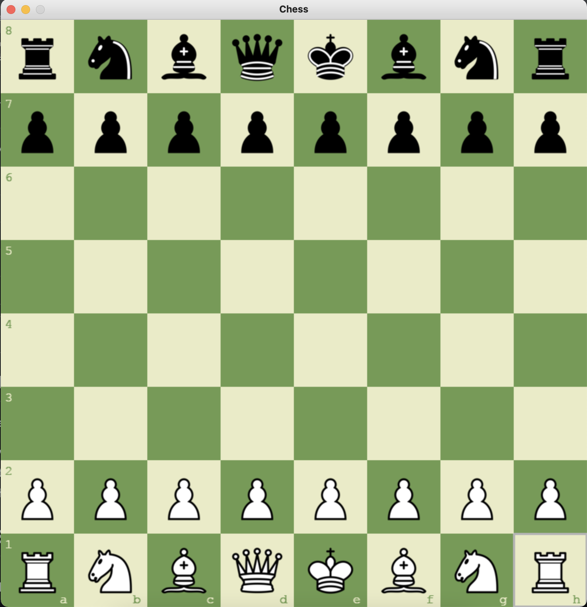
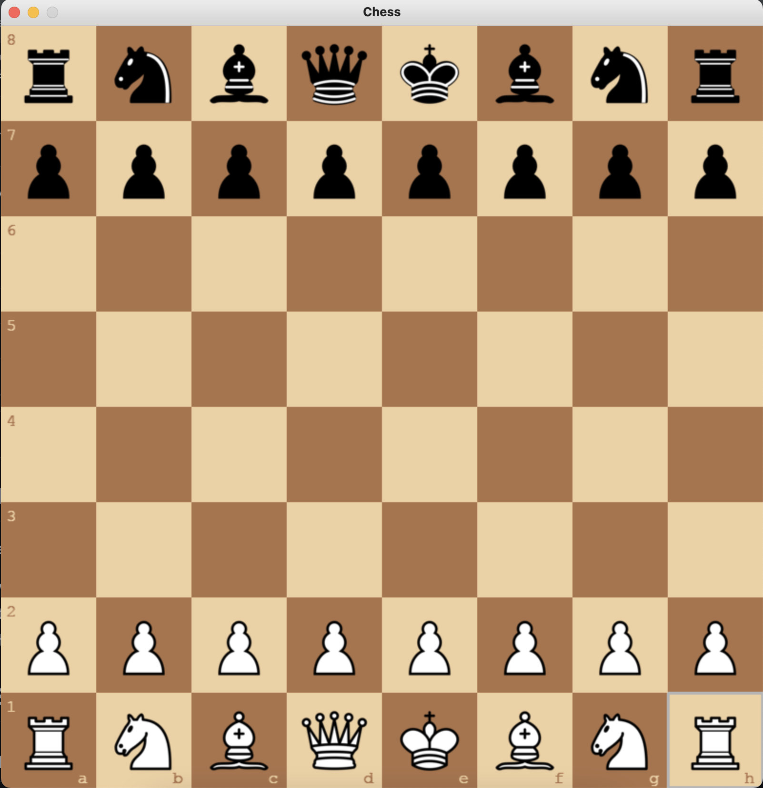
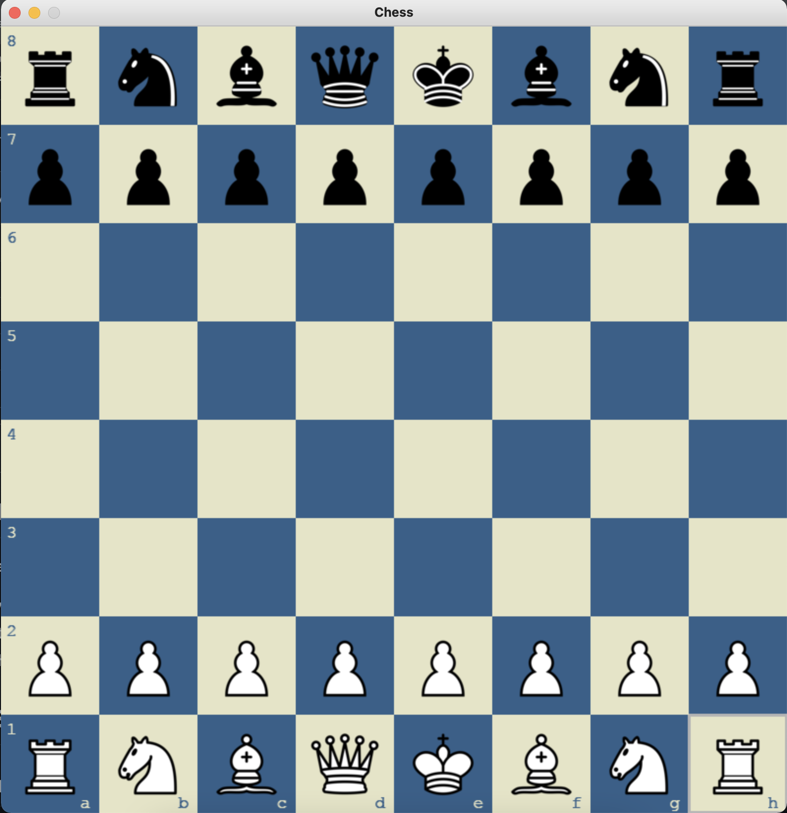
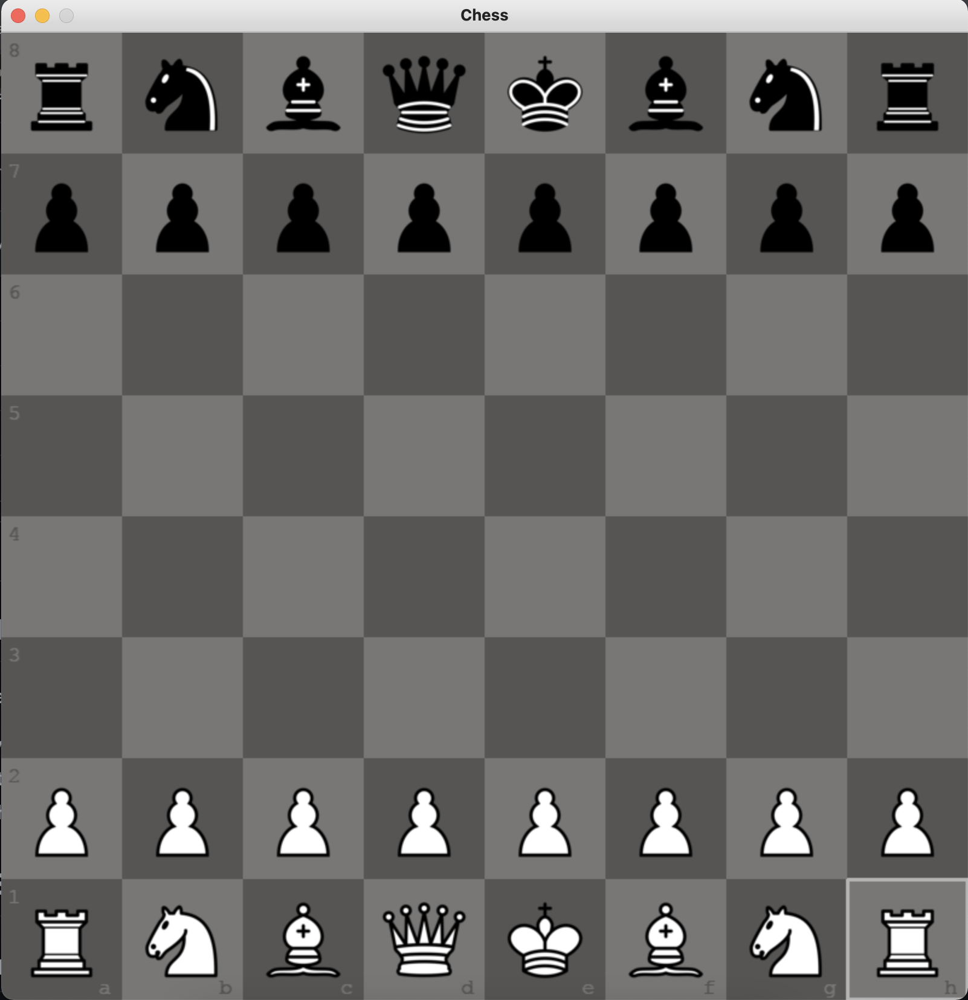
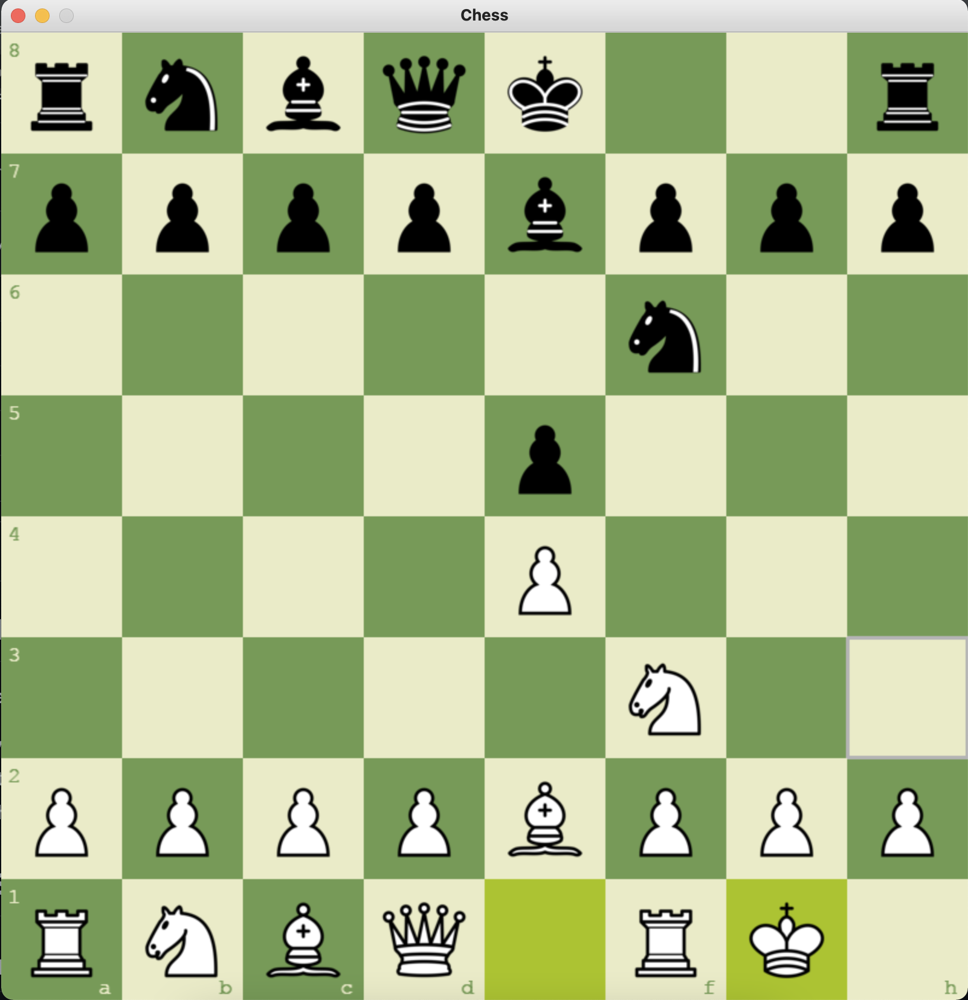

# ♟️ Projet IA Python Chess  
Un moteur de jeu d’échecs avec interface graphique, IA Minimax/Alpha-Beta, gestion des coups, sauvegarde/chargement et interface utilisateur complète.

Ce projet a été développé pour proposer une expérience d’échecs jouable contre une IA configurable, avec une interface moderne construite en Python + Pygame.

---

## 📁 Structure du projet

Voici l’architecture complète du projet, avec le rôle de chaque dossier et fichier :

```text
python-chess-ai-yt/
│
├── assets/                     # Ressources graphiques et sonores
│   ├── images/                 # Pièces d'échecs (80px et 128px)
│   └── sounds/                 # Sons de déplacement et capture
│
├── docs/                       # Documentation (diagrammes, schémas)
│
├── snapshots/                  # Captures d'écran du jeu
│
├── src/                        # Code source principal
│   ├── ai/                     # Intelligence artificielle
│   │   ├── minimax.py          # Algorithme Minimax
│   │   ├── alphabeta.py        # Minimax optimisé Alpha-Beta
│   │   ├── engine.py           # Interface commune pour l’IA
│   │   └── difficulty.py       # Gestion des niveaux de difficulté
│   │
│   ├── config/                 # Paramètres globaux
│   │   ├── color.py            # Palette de couleurs
│   │   ├── config.py           # Configuration générale
│   │   └── const.py            # Constantes du jeu
│   │
│   ├── core/                   # Logique interne du jeu d’échecs
│   │   ├── board.py            # Plateau, règles, mouvements
│   │   ├── piece.py            # Classe de base des pièces
│   │   ├── move.py             # Représentation d’un mouvement
│   │   ├── square.py           # Gestion des cases
│   │   └── evaluation.py       # Fonction d’évaluation pour l’IA
│   │
│   ├── gui/                    # Interface graphique (Pygame)
│   │   ├── app.py              # Boucle principale de l'application
│   │   ├── renderer.py         # Affichage du plateau et des pièces
│   │   ├── dragger.py          # Gestion du drag & drop
│   │   ├── theme.py            # Thèmes graphiques
│   │   └── sound.py            # Gestion des sons
│   │
│   ├── io/                     # Entrées / sorties
│   │   ├── save.py             # Sauvegarde de partie
│   │   └── load.py             # Chargement de partie
│   │
│   ├── game.py                 # Gestion globale d’une partie
│   └── main.py                 # Point d’entrée principal du jeu
│
├── save.json                   # Exemple de fichier de sauvegarde
├── requirements.txt            # Dépendances Python
├── .gitignore                  # Fichiers ignorés par Git
└── README.md                   # Documentation du projet
```


---

## 🧠 Fonctionnalités principales

- ✔️ Interface graphique complète (Pygame)  
- ✔️ IA Minimax + Alpha-Beta  
- ✔️ Plusieurs niveaux de difficulté  
- ✔️ Drag & drop des pièces  
- ✔️ Sons de déplacement et capture  
- ✔️ Sauvegarde / chargement de partie  
- ✔️ Architecture modulaire et évolutive  

---

## 🚀 Installation & Exécution

### 1️⃣ Cloner le dépôt

git clone https://github.com/Abdoul-Faisal-Ouedraogo/Projet-IA-Python-chess-ai.git
cd Projet-IA-Python-chess-ai

### 2️⃣ Créer un environnement virtuel (recommandé)

python -m venv venv

Activer l’environnement :

Windows : venv\Scripts\activate

Linux / Mac : source venv/bin/activate

### 3️⃣ Installer les dépendances

pip install -r requirements.txt

### 4️⃣ Lancer le jeu
```bash
python src/main.py

```
# Game Snapshots

## Snapshot 1 - Start (green)


## Snapshot 2 - Start (brown)


## Snapshot 3 - Start (blue)


## Snapshot 4 - Start (gray)


## Snapshot 5 - Valid Moves


## Snapshot 6 - Castling

